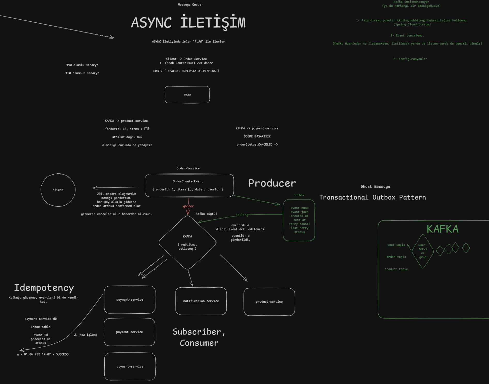

# 1 Haziran Dersi — Kafka ile Asenkron İletişim Notları

Bu dersin ana konusu **mikroservislerde asenkron iletişim**, **Kafka**, **producer-consumer yapısı**, **idempotency**, **transactional outbox pattern** ve Spring Cloud Stream Kafka ile örnek mesaj gönderme/dinleme akışıdır.

---

## 1. Senkron ve Asenkron İletişim Mantığı

Mikroservislerde servisler bazen birbirleriyle doğrudan konuşur. Örneğin:

> Kullanıcı sipariş oluşturmak istiyor. Order Service, Product Service'e “10 ID'li üründen 20 adet var mı?” diye sormak zorunda kalıyor.

Bu durumda **senkron iletişim** devreye girer. Yani Order Service, Product Service'ten cevap bekler.

Ama çok yoğun sistemlerde her şeyi senkron yapmak sistemi yavaşlatabilir. Örneğin Amazon gibi büyük sistemlerde her servis doğrudan diğer servisin cevabını beklerse sipariş süreci çok yavaşlar.


### Amazon örneği

Derste şu örnek verildi:

> Amazon bazen ödeme kesinleşmeden siparişi oluşturulmuş gibi gösterebilir. Eğer kart bakiyesi yoksa veya ödeme başarısız olursa 10 dakika sonra sipariş iptal edilebilir.

Buradaki mantık şudur:

- Senaryoların büyük çoğunluğu başarılıdır.
- Yaklaşık `%90` olumlu senaryoda ödeme ve stok işlemleri sorunsuz ilerler.
- Yaklaşık `%10` olumsuz senaryoda stok bitmiş olabilir veya ödeme başarısız olabilir.

Sistemi tüm kullanıcılar için yavaşlatmak yerine, olumlu senaryolar hızlı ilerletilir. Olumsuz senaryolar ise event/message yapısıyla sonradan düzeltilir.

Bu yüzden asenkron iletişim özellikle yoğun sistemlerde önemlidir.

---

## 2. Async İletişim Nedir?

**Async iletişim**, servislerin birbirini beklemeden haberleşmesidir.

Basit mantık:

1. Bir servis bir olay üretir.
2. Bu olayı Kafka gibi bir message queue / event streaming sistemine gönderir.
3. Diğer servisler bu olayı dinler.
4. İlgili servisler kendi işlerini yapar.

Yani Order Service, Product Service'e doğrudan “hemen cevap ver” demek yerine Kafka'ya bir event bırakır. Product Service bu eventi dinler ve stok işlemini yapar.

---


## 3. Message Queue ve Kafka

Async iletişimde kullanılan sistemlere genel olarak **message queue** denir. Kafka da bu sistemlerden biridir.

Ama Kafka sadece klasik bir mesaj kuyruğu gibi düşünülmemelidir. Derste şöyle açıklandı:

> Kafka, mesaj kuyruğundan ziyade dağıtık bir commit log gibi düşünülebilir.

Kafka mimarisinde önemli kavramlar vardır:

- **Topic**
- **Partition**
- **Offset**
- **Producer**
- **Consumer / Subscriber**
- **Consumer group**

Bunlar Kafka'nın mesajları düzenli, sıralı ve takip edilebilir şekilde saklamasını sağlar.

---

## 4. Producer ve Consumer Mantığı

Kafka'da iki ana rol vardır:

### Producer

Mesajı/eventi üreten servistir.

Örnek:

- Order Service sipariş oluşturur.
- `OrderCreatedEvent` üretir.
- Bu eventi Kafka'ya gönderir.

### Consumer / Subscriber

Kafka'daki mesajı dinleyen servistir.

Örnek:

- Product Service `OrderCreatedEvent` mesajını dinler.
- Siparişteki ürünlerin stok kontrolünü yapar.
- Gerekirse stok düşer.


---

## 5. Saga Pattern ile İlişkisi

Derste şu soru soruldu:

> Bu örnek bizim için bir Saga Pattern örneği midir, yoksa Saga'nın ayrıştığı noktalar var mı?

Cevap:

Bu çizim tek başına tam bir Saga Pattern değildir. Saga diyebilmemiz için servislerin sadece event dinlemesi yetmez. Servislerin işlem sonucunu tekrar Order Service'e bildirmesi gerekir.

Örneğin:

1. Order Service sipariş oluşturur.
2. Product Service stok kontrol eder.
3. Payment Service ödeme kontrol eder.
4. Bu servisler başarılı veya başarısız sonuç eventlerini tekrar Order Service'e yollar.
5. Order Service bu eventleri yakalayıp siparişin durumunu günceller.

Örnek durum güncellemeleri:

- `ORDER_CREATED`
- `STOCK_RESERVED`
- `PAYMENT_COMPLETED`
- `ORDER_COMPLETED`
- `ORDER_CANCELLED`

Yani Saga'da önemli nokta, servislerin birbirinden gelen ters eventlerle süreci yönetmesidir.

---

## 6. Kafka'da Olası Problem: Aynı Mesajın Birden Fazla İşlenmesi

Mikroservis yapısında aynı anda bir servisin birden fazla instance'ı çalışabilir.

Örneğin:

> Aynı anda 5 tane Payment Service çalışıyor olabilir.

Kafka bazı durumlarda aynı mesajı tekrar gönderebilir. Bunun sebeplerinden biri **acknowledgement fail** durumudur.

Yani Kafka mesajı gönderir ama consumer mesajı işlediğini Kafka'ya düzgün bildiremezse Kafka “mesaj işlenmedi” sanabilir ve aynı mesajı tekrar gönderebilir.

Bu durumda dikkat edilmezse tehlikeli sonuçlar ortaya çıkar.

Örneğin Payment Service aynı ödeme mesajını iki kez işlerse:

- Kullanıcının kartından iki kez para çekilebilir.
- Aynı stok iki kez düşülebilir.
- Aynı bildirim iki kez gönderilebilir.

Bu yüzden **idempotency** çok önemlidir.

---

## 7. Idempotency Nedir?

**Idempotency**, aynı işlem yanlışlıkla birden fazla kez çağrılsa bile sistemin sonucu sadece bir kez uygulamasıdır.

Basit örnek:

> Payment Service, bir ödeme eventini işlemeden önce bu event daha önce işlendi mi diye kontrol eder.

Bunun için genelde bir **inbox table** kullanılır.

Örnek inbox table alanları:

| Alan | Açıklama |
|---|---|
| `event_id` | Gelen eventin benzersiz ID'si |
| `processed_at` | Eventin ne zaman işlendiği |
| `status` | İşlemin başarılı/başarısız durumu |

Akış:

1. Consumer event alır.
2. Önce inbox table'a bakar.
3. Aynı `event_id` daha önce işlenmişse tekrar işlem yapmaz.
4. Daha önce işlenmemişse işlemi yapar ve tabloya kaydeder.


### Neden gerekli?

Kafka yanlışlıkla aynı eventi tekrar gönderirse Payment Service aynı ödemeyi tekrar almamalıdır. Idempotency bu hatayı engelleyen güvenlik mekanizmasıdır.

---

## 8. Producer Tarafındaki Problem: Kafka'ya Mesaj Gönderilemezse Ne Olur?

Consumer tarafında aynı mesajın tekrar işlenmesi problemi vardı. Producer tarafında ise farklı bir problem vardır.

Örneğin:

1. Order Service veritabanına siparişi kaydetti.
2. Hemen ardından Kafka'ya `OrderCreatedEvent` göndermesi gerekiyor.
3. Ama tam o anda Kafka kapalı veya erişilemez durumda.

Bu durumda sipariş veritabanında oluşmuş olur ama event Kafka'ya gitmez.

Bu probleme bazen **ghost message** veya kayıp event problemi denebilir.

Çözüm olarak **Transactional Outbox Pattern** kullanılır.

---

## 9. Transactional Outbox Pattern Nedir?

Transactional Outbox Pattern, mesajı doğrudan Kafka'ya göndermek yerine önce veritabanındaki bir outbox tablosuna yazma yöntemidir.

Akış:

1. Order Service siparişi oluşturur.
2. Aynı transaction içinde hem siparişi hem de gönderilecek eventi outbox tablosuna yazar.
3. Ayrı bir worker/scheduler outbox tablosundaki gönderilmemiş eventleri okur.
4. Kafka'ya gönderir.
5. Gönderim başarılı olunca outbox kaydının durumunu günceller.


Outbox tablosunda olabilecek alanlar:

| Alan | Açıklama |
|---|---|
| `event_id` | Eventin benzersiz ID'si |
| `event_name` | Event adı |
| `event_json` | Event içeriği |
| `created_at` | Oluşturulma zamanı |
| `sent_at` | Kafka'ya gönderilme zamanı |
| `retry_count` | Kaç kez denenmiş |
| `last_retry_at` | Son deneme zamanı |
| `status` | Bekliyor, gönderildi, hata aldı gibi durum bilgisi |

Bu pattern sayesinde veritabanı ve Kafka arasında veri kaybı riski azaltılır.

---

## 10. Docker Compose Nedir?

Derste Kafka kurmak için Docker kullanıldı.

**Docker Compose**, birden fazla container'ı tek komutla ayağa kaldırmayı sağlar.

Normalde her container için ayrı ayrı `docker run` komutu yazmak gerekir. Docker Compose ile bu komutlar `docker-compose.yaml` dosyasında toplanır.

Örneğin bu derste aynı anda iki servis ayağa kaldırıldı:

- Kafka
- Kafka UI

Komut:

```bash
docker compose up -d
```

Bu komut Kafka ve Kafka UI containerlarını arka planda çalıştırır.

---

## 11. Kafka İçin Docker Compose Dosyası

Mikroservis projesinin dışına bir `docker` klasörü açılır. İçine `docker-compose.yaml` dosyası eklenir.

```yaml
services:
  kafka:
    image: apache/kafka:4.2.0
    container_name: kafka
    ports:
      - "9092:9092"          # host -> broker (EXTERNAL listener)
    environment:
      # --- KRaft kimlik ve roller ---
      KAFKA_NODE_ID: 1
      KAFKA_PROCESS_ROLES: broker,controller        # tek node hem broker hem controller
      KAFKA_CONTROLLER_QUORUM_VOTERS: 1@kafka:9093

      # --- Listener tanımları ---
      # Üç ayrı listener: container içi (INTERNAL), host (EXTERNAL), controller
      KAFKA_LISTENERS: INTERNAL://0.0.0.0:19092,EXTERNAL://0.0.0.0:9092,CONTROLLER://0.0.0.0:9093
      KAFKA_ADVERTISED_LISTENERS: INTERNAL://kafka:19092,EXTERNAL://localhost:9092
      KAFKA_LISTENER_SECURITY_PROTOCOL_MAP: INTERNAL:PLAINTEXT,EXTERNAL:PLAINTEXT,CONTROLLER:PLAINTEXT
      KAFKA_INTER_BROKER_LISTENER_NAME: INTERNAL
      KAFKA_CONTROLLER_LISTENER_NAMES: CONTROLLER

      # --- Tek node olduğu için replikasyon faktörleri 1 ---
      KAFKA_OFFSETS_TOPIC_REPLICATION_FACTOR: 1
      KAFKA_TRANSACTION_STATE_LOG_REPLICATION_FACTOR: 1
      KAFKA_TRANSACTION_STATE_LOG_MIN_ISR: 1

      # --- Geliştirme kolaylıkları ---
      KAFKA_GROUP_INITIAL_REBALANCE_DELAY_MS: 0
      KAFKA_AUTO_CREATE_TOPICS_ENABLE: "true"
      KAFKA_NUM_PARTITIONS: 3
    volumes:
      - kafka-data:/var/lib/kafka/data
    healthcheck:
      test: ["CMD-SHELL", "/opt/kafka/bin/kafka-broker-api-versions.sh --bootstrap-server localhost:9092 || exit 1"]
      interval: 10s
      timeout: 10s
      retries: 10
    networks:
      - kafka-net

  kafka-ui:
    image: kafbat/kafka-ui:latest
    container_name: kafka-ui
    ports:
      - "8080:8080"          # http://localhost:8080
    environment:
      KAFKA_CLUSTERS_0_NAME: local
      KAFKA_CLUSTERS_0_BOOTSTRAPSERVERS: kafka:19092
      DYNAMIC_CONFIG_ENABLED: "true"
    depends_on:
      kafka:
        condition: service_healthy
    networks:
      - kafka-net

volumes:
  kafka-data:

networks:
  kafka-net:
    driver: bridge
```

### Önemli kısımlar

| Kısım | Anlamı |
|---|---|
| `kafka` | Kafka broker container'ı |
| `kafka-ui` | Kafka'yı tarayıcıdan izlemeyi sağlayan arayüz |
| `9092:9092` | Uygulamanın localhost üzerinden Kafka'ya bağlanması için port |
| `8080:8080` | Kafka UI arayüz portu |
| `KAFKA_AUTO_CREATE_TOPICS_ENABLE: "true"` | Topic yoksa otomatik oluşturulmasını sağlar |
| `KAFKA_NUM_PARTITIONS: 3` | Otomatik oluşan topiclerin 3 partition ile oluşmasını sağlar |


---

## 12. Spring Cloud Stream Kafka Bağımlılığı

Product Service ve User Service arasında Kafka ile mesaj göndermek için her iki servisin `pom.xml` dosyasına şu bağımlılık eklenir:

```xml
<dependency>
    <groupId>org.springframework.cloud</groupId>
    <artifactId>spring-cloud-starter-stream-kafka</artifactId>
</dependency>
```

Sonra mikroservislerin bulunduğu klasörde build alınır:

```bash
mvn clean install
```

---

## 13. Örnek Event Sınıfı

Derste Product Service ile User Service arasında basit bir test mesajı gönderildi.

Genelde eventler proje içinde ayrı bir `event` paketinde tutulur.

Product Service içinde örnek event:

```java
package com.turkcell.product_service.event;

import java.util.UUID;

public record TestEvent(String message, UUID productId) {
}
```

### Record neden kullanıldı?

Eventler genelde sadece veri taşır. Java `record` yapısı bu tarz veri taşıyan sınıflar için pratiktir.

Bu event içinde iki bilgi var:

- `message`
- `productId`

---

## 14. Product Service: Producer Tarafı

Product Service mesajı gönderen taraftır. Bu yüzden burada **producer** rolü vardır.

Controller örneği:

```java
@RequestMapping("/api/products")
@RestController
public class ProductsController {

    private final StreamBridge streamBridge;

    public ProductsController(StreamBridge streamBridge) {
        this.streamBridge = streamBridge;
    }

    @GetMapping
    public String test(@RequestParam String message) {
        var event = new TestEvent(message, UUID.randomUUID());
        streamBridge.send("testEvent-out-0", event);
        return "Başarılı";
    }
}
```

### StreamBridge nedir?

`StreamBridge`, Spring Cloud Stream içinde mesaj göndermek için kullanılan köprü yapısıdır.

Kod içinde doğrudan Kafka API'si kullanılmaz. Bunun yerine Spring Cloud Stream üzerinden mesaj gönderilir.

Bu önemli bir avantajdır. Çünkü ileride Kafka yerine RabbitMQ gibi başka bir message queue kullanmak istenirse kodun büyük kısmı değişmez. Daha çok konfigürasyon değişir.

---

## 15. Product Service application.yaml Ayarı

Product Service'in Kafka'ya mesaj göndermesi için binding tanımlanır.

```yaml
spring:
  application:
    name: product-service
  cloud:
    stream:
      bindings:
        testEvent-out-0:
          destination: test-topic
          content-type: application/json
      kafka:
        binder:
          brokers: localhost:9092
```

### Binding mantığı

```java
streamBridge.send("testEvent-out-0", event);
```

Buradaki `testEvent-out-0` ismi ile YAML içindeki binding ismi aynı olmalıdır.

```yaml
testEvent-out-0:
  destination: test-topic
```

Yani:

- `testEvent-out-0` → kodda kullanılan binding adı
- `destination: test-topic` → Kafka'daki topic adı

---

## 16. Topic Nedir?

Kafka'da mesajlar **topic** adı verilen başlıklara gönderilir.

Örnek topic isimleri:

- `test-topic`
- `order-topic`
- `product-topic`
- `payment-topic`

Producer bir topice mesaj gönderir. Consumer ise aynı topice abone olur ve mesajları dinler.

Bu derste Product Service şu topice mesaj gönderdi:

```yaml
destination: test-topic
```

User Service de aynı topic'i dinledi.

---

## 17. Binding İsimlendirme Kültürü

Derste şu isim kullanıldı:

```text
testEvent-out-0
```

Bunun anlamı:

| Parça | Anlamı |
|---|---|
| `testEvent` | Gönderilen eventin adı |
| `out` | Bu servisin mesaj gönderdiğini gösterir |
| `0` | Aynı event için birden fazla binding olabilir diye verilen indeks |

Eğer servis mesaj dinliyor olsaydı `out` yerine `in` kullanılırdı.

Örnek:

```text
consumeTestEvent-in-0
```

---

## 18. Product Service'e Test İsteği Atma

Product Service çalıştırıldıktan sonra şu GET isteği atıldı:

```text
localhost:8082/api/products?message=Merhaba
```

Bu istekle Product Service:

1. `message=Merhaba` parametresini aldı.
2. `TestEvent` nesnesi oluşturdu.
3. Eventi `testEvent-out-0` binding'i ile Kafka'ya gönderdi.
4. Kafka mesajı `test-topic` içine yazdı.

Bu mesaj Kafka UI üzerinde görülebildi.

Ama asıl amaç mesajı UI'da görmek değildir. Asıl amaç, bu mesajı User Service'in okuyabilmesidir.

---

## 19. User Service: Consumer Tarafı

User Service mesajı dinleyen taraftır. Bu yüzden burada **consumer** rolü vardır.

User Service içinde de aynı event tanımlanır.

### Neden aynı eventi iki serviste de yazıyoruz?

Çünkü Product Service ve User Service iki ayrı projedir/servistir. Her servis kendi kodundan sorumludur. Bu yüzden ikisinde de event modelinin tanımlanması normaldir.

---

## 20. User Service Consumer Sınıfı

User Service içinde bir `consumer` paketi açıldı. İçine `TestEventConsumer` sınıfı yazıldı.

```java
@Configuration
public class TestEventConsumer {

    @Bean
    public Consumer<TestEvent> consumeTestEvent() {
        return event -> {
            System.out.println("TestEvent İŞLENDİ: " + event.message() + ", Product ID: " + event.productId());
        };
    }
}
```

### Bu kod ne yapıyor?

- `@Configuration` sınıfın konfigürasyon sınıfı olduğunu belirtir.
- `@Bean` Spring'e bu metodu yönetmesini söyler.
- `Consumer<TestEvent>` Kafka'dan gelen `TestEvent` mesajlarını dinler.
- Gelen event console'a yazdırılır.

Burada return edilen yapı bir consumer olduğu için geriye yeni bir event dönmez. Sadece gelen eventi işler.

---

## 21. User Service application.yaml Ayarı

User Service'in Kafka'dan mesaj dinlemesi için şu konfigürasyon yazılır:

```yaml
spring:
  application:
    name: user-service
  cloud:
    function:
      definition: consumeTestEvent
    stream:
      bindings:
        consumeTestEvent-in-0:
          destination: test-topic # hangi başlıktan bu eventi dinleyeyim?
          group: user-service-group # hangi grup olarak dinliyorum?
      kafka:
        binder:
          brokers: localhost:9092

server:
  port: 8081

management:
  endpoints:
    web:
      exposure:
        include: "*"
```


### Önemli noktalar

| Ayar | Anlamı |
|---|---|
| `function.definition: consumeTestEvent` | Hangi consumer bean'inin çalışacağını belirtir |
| `consumeTestEvent-in-0` | Consumer binding adıdır |
| `destination: test-topic` | Dinlenecek Kafka topic'idir |
| `group: user-service-group` | Consumer group adıdır |
| `brokers: localhost:9092` | Kafka bağlantı adresidir |
| `server.port: 8081` | User Service portudur |

---

## 22. Producer ve Consumer Çalışma Farkı

Derste önemli bir fark anlatıldı:

### Producer tarafı

Product Service producer olduğu için Kafka'ya ancak controller'a istek atıldığında mesaj gönderir.

Yani:

```text
localhost:8082/api/products?message=Merhaba
```

isteği atılınca Product Service Kafka'ya bağlanıp mesaj gönderir.

### Consumer tarafı

User Service consumer olduğu için uygulama ayağa kalkar kalkmaz Kafka'ya bağlanır ve topic'i dinlemeye başlar.

Yani User Service'in herhangi bir controller'ını çağırmaya gerek yoktur.

Product Service mesajı gönderdiği anda User Service mesajı yakalar ve console'a şunu yazar:

```text
TestEvent İŞLENDİ: Merhaba, Product ID: ...
```

Buradaki önemli fikir:

> Product Service, User Service'i doğrudan çağırmadı. Kafka üzerinden User Service'i haberdar etti.

Bu, asenkron iletişimin temel mantığıdır.

---

## 23. Genel Tekrar: Kafka Entegrasyonu İçin Adımlar

Derste genel tekrar şu şekilde yapıldı:

### 1. Paket / bağımlılık eklenir

```xml
<dependency>
    <groupId>org.springframework.cloud</groupId>
    <artifactId>spring-cloud-starter-stream-kafka</artifactId>
</dependency>
```

### 2. Event tanımlanır

Producer ve consumer tarafında taşınacak veri modeli hazırlanır.

```java
public record TestEvent(String message, UUID productId) {
}
```

### 3. Producer tarafı yazılır

Product Service içinde `StreamBridge` ile event gönderilir.

```java
streamBridge.send("testEvent-out-0", event);
```

### 4. Consumer tarafı yazılır

User Service içinde `Consumer<TestEvent>` bean'i ile event dinlenir.

```java
@Bean
public Consumer<TestEvent> consumeTestEvent() {
    return event -> {
        System.out.println(event.message());
    };
}
```

### 5. Konfigürasyonlar yapılır

Producer tarafında:

```yaml
testEvent-out-0:
  destination: test-topic
```

Consumer tarafında:

```yaml
consumeTestEvent-in-0:
  destination: test-topic
  group: user-service-group
```

---

## 24. Kafka Yerine RabbitMQ Kullanmak İstersek

Derste şu önemli nokta söylendi:

> Kodun içinde doğrudan Kafka ismi geçmediği için yarın RabbitMQ'ya geçmek istersek çoğunlukla konfigürasyon ve bağımlılık tarafını değiştiririz.

Bu Spring Cloud Stream'in avantajıdır.

Kod tarafında Kafka API'sine doğrudan bağımlı kalmak yerine soyut bir mesajlaşma katmanı kullanılır.

Bu yüzden sistem daha esnek olur.

---

## 25. Ödev

Dersin sonunda verilen ödev:

> Transactional Outbox Pattern ve Idempotency implemente edilmeye çalışılacak. Order Service ile Product Service arasında gerçek bir sipariş akışı event iletişimi kurulacak.

Beklenen akış:

1. Order Service'e POST isteği atılır.
2. Sipariş oluşur.
3. Order Service `OrderCreatedEvent` fırlatır.
4. Product Service bu eventi dinler.
5. Event içindeki her ürün için stok işlemi yapar.

Örnek akış:

```text
Order-Service -> POST Sipariş oluşur
OrderCreatedEvent fırlar
Product-Service bu eventteki her ürün için stok işlemi yapar
```

---

## 26. Akılda Kalıcı Kısa Özet

Bu derste öğrenilen ana fikir:

> Mikroservisler birbirini doğrudan beklemek zorunda kalmasın diye Kafka gibi sistemlerle event tabanlı asenkron iletişim kurulur.

En önemli kavramlar:

| Kavram | Kısa Anlamı |
|---|---|
| Async iletişim | Servislerin birbirini beklemeden haberleşmesi |
| Kafka | Event/message taşıyan dağıtık sistem |
| Producer | Mesajı gönderen servis |
| Consumer | Mesajı dinleyen servis |
| Topic | Mesajların gönderildiği başlık/kanal |
| Binding | Kod ile topic arasındaki bağlantı ismi |
| StreamBridge | Spring Cloud Stream ile mesaj göndermeyi sağlayan yapı |
| Idempotency | Aynı mesaj tekrar gelse bile işlemi bir kez yapma mantığı |
| Inbox table | Consumer'ın işlediği eventleri tuttuğu tablo |
| Transactional Outbox | Producer'ın mesajı önce DB tablosuna yazıp sonra Kafka'ya göndermesi |
| Saga Pattern | Servislerin eventlerle birbirine sonuç bildirip süreci yönetmesi |

---

## Kısa Anlatım

Bu derste mikroservislerde servisler arası asenkron iletişimi öğrendik. Normalde Order Service, Product Service'e senkron şekilde stok var mı diye sorabilir. Ama büyük sistemlerde her servisin birbirini beklemesi sistemi yavaşlatır. Bu yüzden Kafka gibi message queue sistemleri kullanılır.

Product Service örneğinde `StreamBridge` ile bir `TestEvent` Kafka'daki `test-topic` başlığına gönderildi. User Service ise aynı topic'i consumer olarak dinledi. Product Service bir mesaj gönderdiğinde User Service'in controller'ı çağrılmadan otomatik olarak consumer çalıştı ve event işlendi.

Ayrıca Kafka'da aynı mesajın tekrar gelebileceğini öğrendik. Bu yüzden consumer tarafında idempotency kurmak gerekir. Producer tarafında ise Kafka'ya mesaj gönderilemezse event kaybolmasın diye transactional outbox pattern kullanılır.

Dersin sonunda gerçek bir sipariş akışı için Order Service'in `OrderCreatedEvent` üretmesi, Product Service'in de bu eventi dinleyip stok işlemi yapması ödev olarak verildi.
