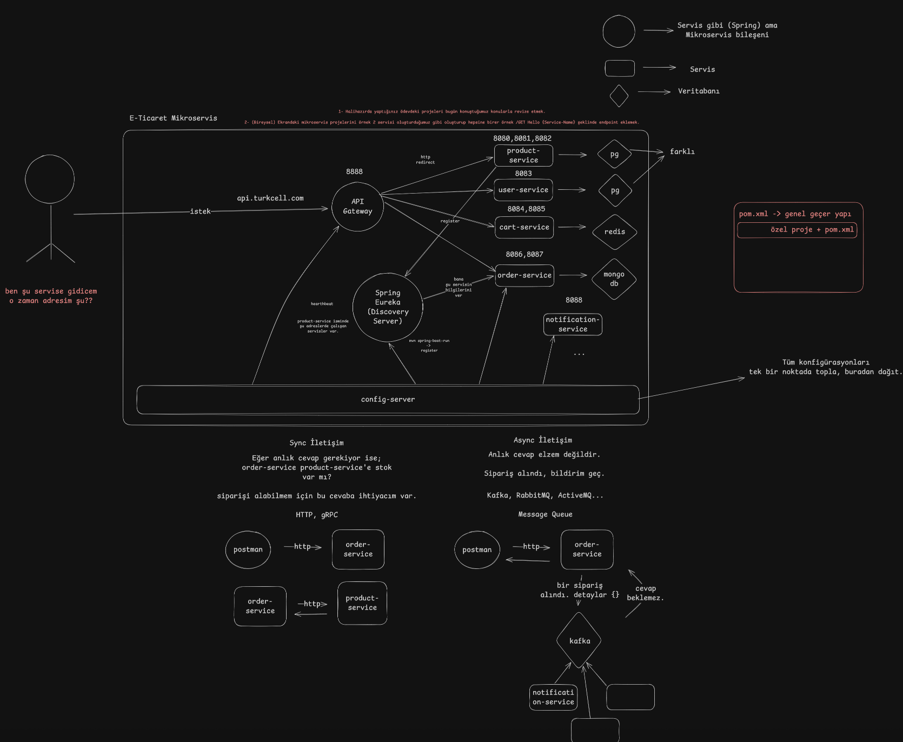
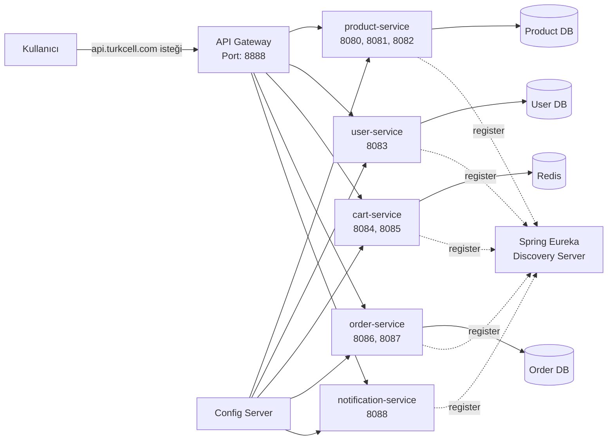
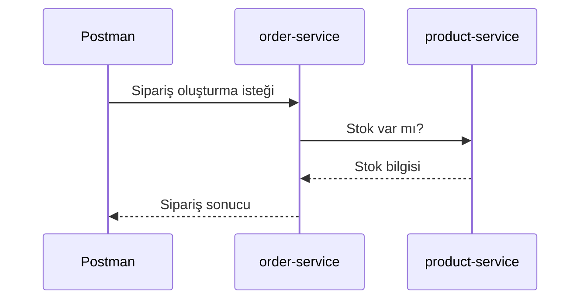
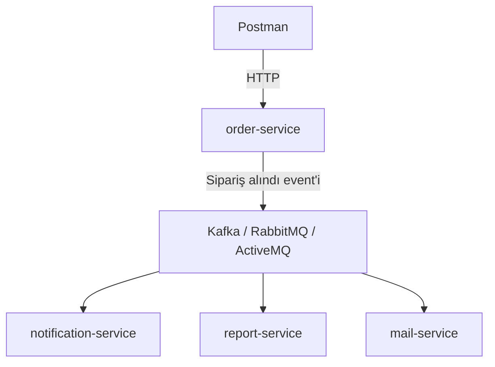

# Mikroservis Ders Notları

Bu dosya;  **Monolith**, **Microservices**, **API Gateway**, **Eureka Discovery Server**, **Config Server**, **senkron/asenkron iletişim**, **topoloji** ve **ödev kapsamı** konularını içerir.
---

## 1. Monolith Nedir?

**Monolith**, bir uygulamanın tüm bileşenlerinin tek bir repoda ve tek bir deployment biriminde birleştirilmesidir.

Yani uygulamanın bütün parçaları tek bir proje gibi geliştirilir, tek bir `.jar` dosyası olarak paketlenir ve tek parça halinde deploy edilir.

```text
SpringApplication.jar

com.turkcell.spring_app
        ↓
spring_app.jar
        ↓
deploy
```

### Monolith Yapının Mantığı

Monolith yapıda genellikle şu parçalar aynı uygulamanın içindedir:

- Controller
- Service
- Repository
- Entity
- Security
- Business rules
- Database bağlantısı
- Config dosyaları

Örneğin:

```text
library-app.jar
```

Bu `.jar` içinde kategori işlemleri de, kitap işlemleri de, kullanıcı işlemleri de, login işlemleri de olabilir.

---

## 2. Monolith Avantajları ve Dezavantajları

### Avantajları

Monolith başlangıçta daha kolaydır çünkü sistem tek parçadır.

| Konu | Monolith |
|---|---|
| Debugging | Kolay |
| Refactoring | Kolay |
| Deployment | Kolay |
| Veritabanı | Genellikle tek veritabanı |
| İletişim | Basit, çünkü servisler aynı uygulama içinde |

### Neden Kolay?

Çünkü her şey aynı projenin içindedir. Bir hatayı debug ederken tek uygulamayı çalıştırırsın. Servisler arası network, gateway, discovery, config-server gibi ekstra konular yoktur.

Örneğin tek komutla uygulamayı ayağa kaldırabilirsin:

```bash
mvn spring-boot:run
```

veya

```bash
java -jar spring_app.jar
```

### Dezavantajları

Monolith büyüdükçe yönetilmesi zorlaşır.

| Konu | Sorun |
|---|---|
| Scaling | Tüm uygulamayı birlikte ölçeklendirmek gerekir |
| Deploy | Küçük bir değişiklik için tüm uygulama deploy edilir |
| Çökme riski | Sistemin bir yeri çökerse tüm uygulamayı etkileyebilir |
| Teknoloji bağımlılığı | Genellikle tüm sistem aynı teknoloji stack'iyle ilerler |

### Monolith Ölçeklendirme Örneği

Monolith yapıda sadece `product` tarafına çok istek gelse bile bütün uygulamayı çoğaltırsın.

```text
TEK .jar

tüm uygulama x 1000
tüm uygulama x 5
```

Yani sadece ürün modülünü değil, login, admin, sepet, sipariş gibi kullanılmayan parçaları da birlikte çoğaltmış olursun.

---

## 3. Microservices Nedir?

**Microservices**, uygulamayı birbirinden bağımsız deploy edilebilen, kendi veritabanına sahip, belirli bir **business capability** yani iş yeteneğine odaklanmış küçük servislere bölme yaklaşımıdır.

Örnek:

```text
user-service     -> PostgreSQL, Spring
product-service  -> MongoDB, Spring
cart-service     -> Redis, Node.js
order-service    -> PostgreSQL, .NET
```

Burada her servis kendi işinden sorumludur.

| Servis | Sorumluluk |
|---|---|
| user-service | Kullanıcı, üyelik, profil, authentication |
| product-service | Ürünler, stok, ürün listeleme |
| cart-service | Sepet işlemleri |
| order-service | Sipariş oluşturma, sipariş durumu |
| notification-service | Bildirim, mail, SMS |
| admin-service | Yönetim paneli işlemleri |

---

## 4. Microservices Yapının Temel Özellikleri

### 4.1 Bağımsız Deploy

Her mikroservis kendi başına deploy edilebilir.

Örneğin sadece `product-service` değiştiyse sadece onu deploy edersin. Tüm sistemi yeniden deploy etmek zorunda kalmazsın.

```text
product-service.jar -> deploy
order-service.jar   -> deploy
user-service.jar    -> deploy
```

### 4.2 Database Per Service

Mikroservislerde önemli kurallardan biri:

> Her servisin kendi veritabanı olmalıdır.

Buna **DPS - Database Per Service** denir.

Örnek:

```text
product-service  -> MongoDB
user-service     -> PostgreSQL
cart-service     -> Redis
order-service    -> PostgreSQL
```

Burada `order-service`, `product-service` veritabanına doğrudan bağlanmamalıdır. Gerekirse `product-service` ile HTTP, gRPC veya message broker üzerinden konuşmalıdır.

### 4.3 Farklı Teknolojiler Kullanılabilir

Mikroservis mimarisinde her servis farklı teknolojiyle yazılabilir.

Örnek:

```text
user-service  -> Spring Boot
cart-service  -> Node.js
order-service -> .NET
```

Bu güzel bir esneklik sağlar ama yönetim zorluğunu da artırır.

---

## 5. Microservices Avantajları ve Dezavantajları

### Avantajları

| Konu | Microservices |
|---|---|
| Scaling | Kolay |
| Deploy | Servis bazlı yapılabilir |
| Teknoloji seçimi | Her servis farklı teknoloji kullanabilir |
| Çökme etkisi | Bir servis bozulsa bile diğerleri çalışmaya devam edebilir |
| Takım çalışması | Her takım farklı servisten sorumlu olabilir |

### Dezavantajları

| Konu | Microservices |
|---|---|
| Debugging | Zor |
| Refactoring | Zor |
| Deployment | Zor |
| İletişim | Zor |
| Veri tutarlılığı | Daha zor |
| Monitoring | Daha kritik |
| DevOps ihtiyacı | Daha fazla |

Hocanın anlattığı önemli mantık:

> Mikroservis 1 problemi çözer ama 10x problem çıkarabilir.  
> Sonra bu 10x problemi çözmek için çözümler kurarsın; bu çözümler de 2x yeni problem yaratır.  
> Sonra o 2x problemleri de çözmen gerekir.

Yani mikroservis güçlüdür ama basit değildir.

---

## 6. Monolith vs Microservices Karşılaştırması

| Konu | Monolith | Microservices |
|---|---|---|
| Uygulama yapısı | Tek proje / tek `.jar` | Birden fazla servis |
| Deployment | Tek seferde tüm uygulama | Servis bazlı deployment |
| Debugging | Daha kolay | Daha zor |
| Refactoring | Daha kolay | Daha zor |
| Scaling | Tüm uygulama ölçeklenir | İhtiyaç olan servis ölçeklenir |
| Veritabanı | Genellikle tek DB | Her servisin kendi DB'si |
| İletişim | Uygulama içi çağrılar | HTTP, gRPC, Kafka, RabbitMQ vb. |
| Başlangıç maliyeti | Düşük | Yüksek |
| Büyük trafik yönetimi | Zorlaşabilir | Daha uygundur |

---

## 7. Selective Scaling Nedir?

**Selective scaling**, sadece ihtiyaç olan servisi ölçeklendirmektir.

Örneğin Black Friday döneminde ürün ve sipariş servislerine çok fazla istek gelebilir.

```text
Black Friday

product-service      x1000
order-service        x1000
user-service         x1
notification-service x10
admin-service        x2
```

Monolith yapıda bunu yapamazsın. Tüm uygulamayı çoğaltman gerekir.

Mikroservis yapıda ise sadece yoğun kullanılan servisleri çoğaltabilirsin.

Bu mikroservislerin en büyük avantajlarından biridir.

---

## 8. E-Ticaret Mikroservis Örneği


Çizilen örneğe göre bir e-ticaret sistemi şöyle düşünülebilir:

```text
Kullanıcı
   |
   | istek
   v
api.turkcell.com
   |
   v
API Gateway
   |
   |-----------------> product-service      -> PostgreSQL / MongoDB
   |-----------------> user-service         -> PostgreSQL
   |-----------------> cart-service         -> Redis
   |-----------------> order-service        -> MongoDB / PostgreSQL
   |-----------------> notification-service
```

Burada kullanıcı doğrudan servislere gitmez. Genellikle önce **API Gateway** üzerinden sisteme giriş yapar.

---

## 9. API Gateway Nedir?

**API Gateway**, dış dünyadan gelen istekleri doğru mikroservise yönlendiren yapıdır.

Genellikle dışarıya açılan tek kapı gibi davranır.

```text
Kullanıcı
   |
   v
API Gateway
   |
   |--> user-service
   |--> product-service
   |--> order-service
   |--> cart-service
```

### API Gateway Ne İşe Yarar?

- Gelen isteği doğru servise yönlendirir.
- Reverse proxy gibi çalışır.
- Authentication/authorization kontrolü yapabilir.
- Rate limiting yapabilir.
- Loglama yapabilir.
- Servis adreslerini kullanıcıdan gizler.

Örneğin kullanıcı şunu bilmez:

```text
product-service hangi portta?
order-service hangi adreste?
cart-service kaç instance çalışıyor?
```

Kullanıcı sadece şuraya istek atar:

```text
api.turkcell.com/products
```

Gateway bu isteği içeride doğru servise yollar.

---

## 10. Reverse Proxy Mantığı

API Gateway genellikle **reverse proxy** mantığıyla çalışır.

Kullanıcı şunu der:

```text
Ben şu servise gitmek istiyorum ama adresim ne?
```

Aslında kullanıcı servisin gerçek adresini bilmez. Gateway bilir ve yönlendirir.

Örnek:

```text
api.turkcell.com/products
        ↓
API Gateway
        ↓
product-service:8080
```

---

## 11. Spring Eureka Discovery Server Nedir?

Mikroservislerde servislerin adresleri dinamik olabilir.

Örneğin bugün `product-service` şu portta çalışabilir:

```text
localhost:8080
```

Yarın başka instance şu portta çalışabilir:

```text
localhost:8081
localhost:8082
```

Bu yüzden servislerin birbirini bulması gerekir. İşte burada **Discovery Server** kullanılır.

Spring dünyasında bunun yaygın örneklerinden biri:

```text
Spring Eureka Discovery Server
```

### Eureka'nın Mantığı

Her servis ayağa kalkınca kendini Eureka'ya kaydeder.

```text
product-service -> Eureka'ya register olur
user-service    -> Eureka'ya register olur
order-service   -> Eureka'ya register olur
```

Eureka şunu bilir:

```text
product-service isimli şu adreslerde çalışan servisler var:
- localhost:8080
- localhost:8081
- localhost:8082
```

Bir servis başka bir servise gitmek istediğinde Eureka'ya sorabilir:

```text
Bana product-service'in adresini ver.
```

Eureka da uygun adresleri döner.

---

## 12. Eureka İçerideki API Gateway Gibi Düşünülebilir mi?

Basit düşünmek için şöyle diyebilirsin:

> API Gateway dışarıdan gelen istekleri doğru servise yönlendirir.  
> Eureka ise içeride servislerin birbirini bulmasını sağlar.

Ama teknik olarak aynı şey değildir.

| Bileşen | Görev |
|---|---|
| API Gateway | Dış istekleri servislere yönlendirir |
| Eureka Discovery Server | Servislerin birbirini dinamik olarak bulmasını sağlar |

---

## 13. Register ve Heartbeat Mantığı

### Register

Bir Spring Boot mikroservisi ayağa kalktığında Eureka'ya kendini kaydeder.

```bash
mvn spring-boot:run
```

Uygulama başladıktan sonra:

```text
product-service -> Ben çalışıyorum, adresim şu.
```

diye Eureka'ya bilgi verir.

### Heartbeat

Eureka belirli aralıklarla servislerin hâlâ ayakta olup olmadığını kontrol eder.

Dersteki not:

```text
Eureka her 10 saniyede bir "ayakta mısın?" diye kontrol eder.
```

Buna **heartbeat** denir.

Servis cevap vermezse Eureka zamanla o servisi listeden çıkarır.

---

## 14. Config Server Nedir?

Mikroservislerde her servisin farklı ortamlar için ayrı konfigürasyonları olabilir.

Örnek ortamlar:

```text
local
dev
test
prod
```

Her servis için dosyalar şöyle artabilir:

```text
application.yaml
application-dev.yaml
application-test.yaml
application-prod.yaml
```

Eğer 6 servis varsa ve her serviste 4 config dosyası varsa:

```text
6 servis x 4 dosya = 24 config dosyası
```

Bu küçük bir sistemde bile çok fazla konfigürasyon demektir.

### Config Server'ın Amacı

**Config Server**, tüm servislerin konfigürasyonlarını tek bir noktada toplamaya yarar.

```text
config-server
     |
     |--> product-service config
     |--> user-service config
     |--> order-service config
     |--> cart-service config
```

Özet cümle:

> Tüm konfigürasyonları tek bir noktada topla, buradan dağıt.

### Neden Gerekli?

Production ortamında local database kullanılmaz.

Örneğin local ortamda:

```yaml
spring:
  datasource:
    url: jdbc:postgresql://localhost:5433/mydb
    username: postgres
    password: 12345
```

Production ortamında:

```yaml
spring:
  datasource:
    url: jdbc:postgresql://prod-db:5432/appdb
    username: prod_user
    password: daha_guvenli_sifre
```

Bu bilgileri her serviste ayrı ayrı yönetmek zorlaşır. Config Server bu karmaşayı azaltır.

---

## 15. Spring Cloud Nedir?

Spring dünyasında mikroservis geliştirmek için kullanılan yapıların çoğu **Spring Cloud** altında toplanır.

Dersteki not:

> Spring mikroservis dünyasını Spring Cloud altında toplamış.  
> Spring Cloud, distributed application geliştirmek için kullanılan paket topluluğudur.

Örnek Spring Cloud bileşenleri:

- Spring Cloud Gateway
- Eureka Discovery Client
- Config Server
- Config Client
- Circuit Breaker yapıları
- Load balancing yapıları

Not:

> Eureka, Netflix ürünüdür.

---

## 16. Sync İletişim Nedir?

**Senkron iletişim**, servisin cevabı hemen beklediği iletişim türüdür.

Örnek senaryo:

```text
order-service product-service'e sorar:
"Bu ürünün stoğu var mı?"
```

Sipariş alabilmek için bu cevaba hemen ihtiyaç vardır.

```text
order-service -> product-service
              <- cevap
```

Bu durumda order-service bekler. Product-service cevap vermeden işlem devam edemez.

### Kullanılan Teknolojiler

- HTTP
- REST
- gRPC

Örnek:

```text
Postman
   |
   | HTTP
   v
order-service
   |
   | HTTP
   v
product-service
   |
   | cevap
   v
order-service
```

### Sync İletişim Ne Zaman Kullanılır?

Anlık cevap gerekiyorsa kullanılır.

Örnekler:

- Stok kontrolü
- Ödeme doğrulama
- Kullanıcı yetki kontrolü
- Sipariş oluşturma öncesi ürün kontrolü

---

## 17. Async İletişim Nedir?

**Asenkron iletişim**, cevabın hemen gerekmediği durumlarda kullanılır.

Örnek:

```text
Sipariş alındı, bildirim gönder.
```

Burada siparişin oluşması için bildirimin hemen gönderilmesi şart değildir.

Sipariş oluşturulur, sonra bir mesaj kuyruğuna olay bırakılır.

```text
order-service
    |
    | "sipariş alındı" event'i
    v
Kafka / RabbitMQ / ActiveMQ
    |
    v
notification-service
```

### Kullanılan Teknolojiler

- Kafka
- RabbitMQ
- ActiveMQ
- Message Queue sistemleri

### Async İletişim Ne Zaman Kullanılır?

Anlık cevap gerekmiyorsa kullanılır.

Örnekler:

- Mail gönderme
- SMS gönderme
- Bildirim gönderme
- Raporlama
- Loglama
- Event yayma

---

## 18. Sync ve Async Karşılaştırması

| Konu | Sync | Async |
|---|---|---|
| Cevap beklenir mi? | Evet | Hayır |
| Kullanım amacı | Anlık karar gereken işler | Sonradan yapılabilecek işler |
| Teknolojiler | HTTP, gRPC | Kafka, RabbitMQ, ActiveMQ |
| Örnek | Stok var mı? | Sipariş alındı bildirimi gönder |
| Risk | Karşı servis yavaşsa bekletir | Event yönetimi karmaşıklaşır |

---

## 19. Mikroserviste Bir Servis Çökerse Ne Olur?

Dersteki önemli not:

> Monolith'te sistemin bir yeri çökerse her yeri etkilenebilir.  
> Mikroserviste bir servis bozulursa diğer servisler çalışabilmelidir.

Örneğin:

```text
notification-service çöktü
```

Bu durumda ideal olarak:

```text
user-service çalışmaya devam eder
product-service çalışmaya devam eder
order-service çalışmaya devam eder
```

Ama notification-service'in yaptığı işler aksar.

Bu yüzden mikroservislerde şunlar önemlidir:

- Timeout
- Retry
- Circuit Breaker
- Fallback
- Message Queue
- Monitoring
- Loglama
- Health check

---

## 20. Strangler Fig Pattern Nedir?

Derste geçen not:

> Monolith'ten mikroservise geçiş bazı patternlerle mümkün ama zahmetlidir.  
> Strangler Fig Pattern bir migration stratejisidir.

**Strangler Fig Pattern**, büyük bir monolith uygulamayı tek seferde parçalamak yerine, zamanla bazı özellikleri mikroservislere taşıma yaklaşımıdır.

### Mantığı

Eski monolith tamamen çöpe atılmaz. Yeni özellikler veya taşınacak modüller yavaş yavaş mikroservis olarak ayrılır.

```text
Başlangıç:
Kullanıcı -> Monolith

Geçiş dönemi:
Kullanıcı -> Gateway
              |--> Yeni product-service
              |--> Yeni order-service
              |--> Eski monolith

Son durum:
Kullanıcı -> Gateway
              |--> product-service
              |--> order-service
              |--> user-service
              |--> cart-service
```

### Neden Kullanılır?

Çünkü büyük bir sistemi bir anda mikroservise çevirmek çok risklidir.

Bu pattern sayesinde:

- Risk azaltılır.
- Sistem çalışmaya devam eder.
- Parça parça geçiş yapılır.
- Eski monolith zamanla küçülür.

---

## 21. Strangler Fig, Mesh Topology midir?

Hayır, doğrudan **mesh topology** değildir.

**Strangler Fig Pattern**, bir **migration stratejisidir**. Yani monolith'ten mikroservise geçerken kullanılan yöntemdir.

**Mesh topology** ise servislerin birbirleriyle nasıl iletişim kurduğunu anlatan bir iletişim topolojisidir.

Kısa fark:

| Kavram | Anlam |
|---|---|
| Strangler Fig Pattern | Monolith'ten mikroservise geçiş stratejisi |
| Star Topology | Servislerin merkezi bir yapı üzerinden haberleşmesi |
| Mesh Topology | Servislerin birbirleriyle daha doğrudan ve yaygın haberleşmesi |

Yani Strangler Fig kullanılarak mikroservise geçilen bir sistem zamanla star veya mesh iletişim yapısına sahip olabilir. Ama Strangler Fig'in kendisi mesh değildir.

---

## 22. Topoloji: İletişim Topolojisi ve Konuşlanma Topolojisi

Derste geçen ayrım önemli:

```text
1. İletişim topolojisi
2. Konuşlanma topolojisi
```

### 22.1 İletişim Topolojisi

Servislerin birbirleriyle nasıl haberleştiğini anlatır.

Örnekler:

```text
Star topology
Mesh topology
Gateway üzerinden iletişim
Message broker üzerinden iletişim
```

### 22.2 Konuşlanma Topolojisi

Servislerin fiziksel veya mantıksal olarak nerede çalıştığını anlatır.

Örnekler:

```text
Aynı makinede mi?
Farklı containerlarda mı?
Kubernetes cluster içinde mi?
Farklı node'larda mı?
Cloud ortamında mı?
```

---

## 23. Mikroservisler Star Topology midir, Mesh Topology'ye Evrilebilir mi?

Mikroservislerde tek bir zorunlu topoloji yoktur.

### Star Topology

Star yapıda merkezde genellikle bir Gateway veya Broker vardır.

```text
          user-service
              |
product-service -- API Gateway -- order-service
              |
          cart-service
```

Dış dünyadan gelen isteklerde genellikle star yapıya benzer bir model vardır:

```text
Client -> API Gateway -> Services
```

### Mesh Topology

Mesh yapıda servisler birbirleriyle daha doğrudan konuşabilir.

```text
order-service -> product-service
order-service -> payment-service
product-service -> inventory-service
user-service -> notification-service
```

Bu yapı büyüdükçe karmaşıklaşır.

### Service Mesh

Büyük sistemlerde bu iletişimleri yönetmek için **service mesh** yapıları kullanılabilir.

Service mesh; servisler arası iletişim, güvenlik, gözlemleme, retry, timeout gibi konuları merkezi olarak yönetmeye yardımcı olur.

Ama temel derste bilmen gereken şey:

> Mikroservisler sadece star olmak zorunda değildir.  
> Gateway ile star gibi başlayabilir, servisler arası iletişim arttıkça mesh benzeri yapıya evrilebilir.

---

## 24. Gateway ve Eureka Beraber Nasıl Çalışır?

Basitleştirilmiş akış:

```text
1. product-service ayağa kalkar.
2. Eureka'ya kendini kaydeder.
3. Gateway bir istek alır.
4. Gateway Eureka'ya product-service nerede diye sorabilir.
5. Eureka çalışan product-service instance'larını döner.
6. Gateway isteği uygun instance'a yönlendirir.
```

Örnek:

```text
Client
  |
  v
API Gateway
  |
  v
Eureka Discovery Server
  |
  v
product-service instance listesi
  |
  v
product-service
```

---

## 25. Mikroservislerde AI Kullanırken Context Problemi

Derste sorduğun soru çok önemli:

> AI'ların context'i görmesi önemli. Mikroservis yapısında diğer servislerin patlama durumunu AI ile geliştirme yaparken nasıl handle edebiliriz? AI diğer servisleri tahmin edebilir ama context'te yoksa negatif etki yaratmaz mı?

Evet, yaratabilir.

Mikroservis yapıda bir servis tek başına anlamlı görünse de aslında diğer servislerle sözleşmeleri vardır.

Örneğin `order-service` geliştirirken AI şunu bilmezse yanlış kod yazabilir:

- product-service hangi endpoint'i sunuyor?
- stok kontrolü sync mi async mi?
- product-service hangi response'u dönüyor?
- hata durumunda ne yapılmalı?
- order-service doğrudan product DB'ye erişebilir mi?
- hangi event Kafka'ya atılıyor?
- servis isimleri Eureka'da nasıl kayıtlı?
- config değerleri nereden geliyor?

### AI Kullanırken Dikkat Edilmesi Gerekenler

AI ile hızlanmak mümkün ama mikroserviste context eksikliği daha risklidir.

Bu yüzden AI'a sadece ilgili sınıfı değil, şu bilgileri de vermek gerekir:

- Servisin görevi
- Diğer servislerle ilişkisi
- API contract bilgileri
- Request/response DTO'ları
- Event şemaları
- Hata yönetimi kuralları
- Database sınırları
- Servislerin sorumluluk sınırları
- Endpoint listesi
- Config bilgileri
- Mimari kararlar

### Önemli Kural

AI'a context vermezsen AI tahmin eder.  
Tahmin edilen kod mikroservislerde tehlikeli olabilir.

Çünkü yanlış tahmin:

- Yanlış endpoint çağrısı
- Yanlış DTO
- Yanlış servis bağımlılığı
- Başka servisin DB'sine doğrudan erişim
- Yanlış hata yönetimi
- Yanlış sync/async kararları

gibi sorunlara sebep olabilir.

### Pratik Çözüm

AI ile mikroservis geliştirirken her serviste şu dosyalar çok faydalıdır:

```text
README.md
API_CONTRACT.md
EVENTS.md
ARCHITECTURE.md
```

Örneğin `order-service` için:

```text
order-service/
  README.md
  API_CONTRACT.md
  EVENTS.md
  src/
```

Böylece AI'a şu denebilir:

```text
Bu order-service'in görevi şu.
Product-service'e sadece şu endpoint üzerinden gider.
Product DB'ye doğrudan erişemez.
Sipariş oluşunca OrderCreated event'i Kafka'ya atılır.
```

Bu yaklaşım AI'ın yanlış tahmin yapma ihtimalini azaltır.

---

## 26. Dersteki Örnek Mikroservis Mimarisi

Aşağıdaki şema derste çizilen e-ticaret mikroservis mantığını özetler.



---

## 27. Sync İletişim Şeması



Burada `order-service`, `product-service` cevabını bekler.

---

## 28. Async İletişim Şeması



Burada `order-service`, bildirimin gönderilmesini beklemek zorunda değildir.

---

## 29. Spring Boot Mikroservis Başlangıç Dependency'leri

Derste geçen başlangıç bağımlılıkları:

```text
Microservices - Spring dependencies:

- Actuator
- DevTools
- Spring Web
- Eureka Discovery Client
```

### Actuator

Servisin health bilgilerini, çalışma durumunu ve bazı metriklerini görmeye yarar.

Örnek:

```text
/actuator/health
```

### DevTools

Geliştirme sürecini kolaylaştırır. Kod değişikliklerinde hızlı restart gibi özellikler sağlar.

### Spring Web

REST API yazmak için kullanılır.

Örnek:

```java
@RestController
@RequestMapping("/api/products")
public class ProductController {
}
```

### Eureka Discovery Client

Servisin Eureka Discovery Server'a kayıt olmasını sağlar.

---


## 32. Tekrar İçin Kısa Özet

### Monolith

Tek uygulama, tek `.jar`, tek deploy.

```text
spring_app.jar -> deploy
```

Kolay başlar ama büyüyünce yönetmesi zorlaşır.

### Microservices

Uygulama küçük servislere ayrılır.

```text
user-service
product-service
cart-service
order-service
notification-service
```

Her servis kendi işinden sorumludur, bağımsız deploy edilebilir ve kendi veritabanına sahip olabilir.

### API Gateway

Dış dünyadan gelen istekleri doğru servise yollar.

```text
Client -> API Gateway -> Service
```

### Eureka

Servislerin birbirini bulmasını sağlar.

```text
product-service -> Eureka'ya register olur
```

### Config Server

Tüm servislerin konfigürasyonlarını merkezi olarak yönetir.

```text
Config Server -> Servis configleri
```

### Sync

Cevap hemen gerekiyorsa kullanılır.

```text
order-service -> product-service: stok var mı?
```

### Async

Cevap hemen gerekmiyorsa kullanılır.

```text
order-service -> Kafka -> notification-service
```

### Strangler Fig Pattern

Monolith'ten mikroservise parça parça geçiş stratejisidir.

### Star ve Mesh

Mikroservislerde iletişim gateway ile star gibi başlayabilir, servisler arası iletişim arttıkça mesh benzeri yapıya evrilebilir.

---

## 33. Ana Fikir

Mikroservis mimarisi büyük sistemlerde çok güçlüdür ama her proje için otomatik olarak en doğru çözüm değildir.

Küçük projelerde monolith daha mantıklı olabilir.  
Trafiği çok yüksek, farklı ekiplerin çalıştığı, farklı parçaların ayrı ölçeklenmesi gereken sistemlerde mikroservis daha anlamlı hale gelir.

Özellikle milyarlarca isteği handle edecek sistemlerde:

- API Gateway
- Discovery Server
- Config Server
- Message Broker
- Container teknolojileri
- Monitoring
- DevOps pipeline

gibi yapılar kritik hale gelir.

Dersteki örnek:

> Trendyol gibi büyük sistemler pandemi sonrası mikroservis dönüşümüne ayak uydurarak rakiplerine fark atmıştır.

---

## 34. Akılda Kalması Gereken Cümleler

- Monolith: Tek proje, tek deploy, tek `.jar`.
- Microservices: Küçük servisler, bağımsız deploy, kendi veritabanı.
- API Gateway: Dış dünyanın sisteme giriş kapısı.
- Eureka: Servislerin birbirini bulduğu adres defteri.
- Config Server: Config dosyalarının merkezi yönetimi.
- Sync: Cevap gerekiyorsa bekle.
- Async: Cevap gerekmiyorsa kuyruğa bırak.
- Database Per Service: Her servis kendi verisini yönetir.
- Strangler Fig: Monolith'i parça parça mikroservise taşıma stratejisi.
- Mikroservis kolaylık değil, büyük sistemler için kontrollü karmaşıklıktır.

